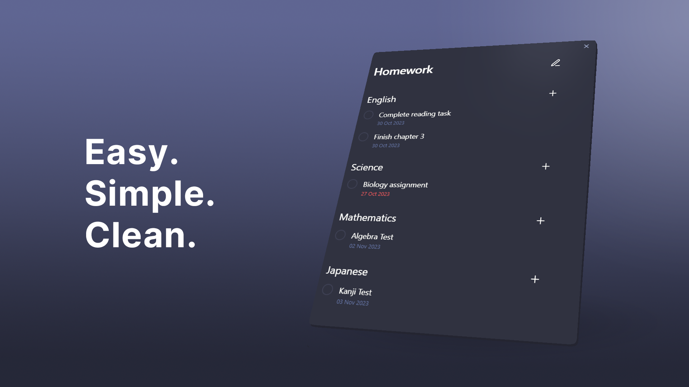

<h1 align="center">
Homework Manager
</h1>

  <h4>An <a href="https://obsidian.md/">Obsidian</a> plugin  that makes keeping track of homework easy.</h4>

  <picture>
    
  </picture>

  <a href="#features">Features</a> &nbsp;&bull;&nbsp;
  <a href="#installation">Installation</a> &nbsp;&bull;&nbsp;
  <a href="#usage">Usage</a> &nbsp;&bull;&nbsp;
  <a href="#contributing">Contributing</a>

 </b>

  
  
  
  This add-on is **not** an official Obsidian add-on.

## Features:
- Easy creation of tasks and subjects
- Task due dates and linking to notes
- Clean and easy to navigate UI

## Installation
- Install through [Obsidian's Community Plugins](https://obsidian.md/plugins) and add directly to your vault.

## Usage
<h3> Open & close</h3>

- Press the book icon on the ribbon bar to open.
- Press the X or click outside the UI to close.

---

### Adding & removing Subjects

Click the edit mode toggle in the top right to add new subjects or delete existing ones.

⚠ Removing a subject removes all tasks underneath it ⚠

---

### Adding & completing tasks

Click the + button next to a subject to add a new task under it. To complete, click the check box on the left of it.

⚠ Completing a task cannot be undone ⚠

---

### Adding due dates

Upon creating a task, a due date can be added. Click the calendar icon to select a date. Due dates set before the current date will appear red.
  
⚠ It is advised to press the calendar icon as missing any elements (`day`, `month`, `year`) will result in creation failure. ⚠

---

### Linking notes

Upon creating a task, a linked note can be added. Click on the task name to take you to the note.

## Contributing
For more information on contributing, please see [development](./docs/development.md).

To track the development, please visit the [project page](https://github.com/users/kadisonm/projects/3/views/1).